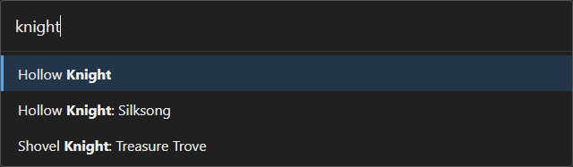

# steam-search

Lightweight Windows tray launcher for installed Steam games. Press `Ctrl+Shift+Insert`, type a few
letters, press Enter.



*The search window with the query "knight" (development demo mode).*

## Features

- Opens just above the system tray icon, on the monitor that holds the taskbar (below it when the
  taskbar is at the top of the screen). The window grows upward as results appear.
- Starts with Windows by default (setting `startWithWindows`, or the tray menu checkbox).
- Scans every Steam library on every drive at startup, then again in the background each time the
  window opens. Results appear from the cache immediately.
- Lists only fully installed games; Steam tools (Proton, Steam Linux Runtime, Steamworks Common
  Redistributables) are ignored.
- Tolerant search: initials (`hk`, `bg3`), words in any order, case and accents ignored, simple typos.
- Keyboard only: Up and Down move the selection, Enter launches, Escape closes. Clicking a row also
  launches the game. The window closes when it loses focus.
- Single instance: starting the program again opens the search window of the running instance.

## Requirements

- Windows 10 or 11 (64-bit), with Steam installed.
- Microsoft Edge WebView2 Runtime (included in Windows 11, usually present on Windows 10).

## Download

Get `steam-search-<version>-windows.exe` and its `.sha256` file from the **Releases** page. To check
the download, compare the file content with:

```powershell
(Get-FileHash .\steam-search-<version>-windows.exe -Algorithm SHA256).Hash.ToLower()
```

The executable is not code-signed, so Windows SmartScreen may warn on first launch ("More info",
then "Run anyway"). There is no installer: put the file in a folder of your choice and run it.

## Configuration

Settings live in `%APPDATA%\steam-search\config.json`, created on first launch. Open it from the tray
menu (**Open config file**), edit it, then choose **Reload settings**.

```json
{
  "hotkey": "Ctrl+Shift+Insert",
  "maxResults": 50,
  "steamPath": "",
  "startWithWindows": true
}
```

| Key | Default | Meaning |
|---|---|---|
| `hotkey` | `Ctrl+Shift+Insert` | Global shortcut that opens or closes the window. Modifiers: `Ctrl`, `Shift`, `Alt`, `Win`. `Ins` is accepted for `Insert`. |
| `maxResults` | `50` | Maximum number of results (1-500). Eight rows are visible, the rest scrolls. |
| `steamPath` | empty | Steam folder, only needed if automatic detection fails (JSON escaping: `"D:\\Steam"`). |
| `startWithWindows` | `true` | Adds the program to the current user's startup programs (`HKCU\...\Run`). |

While steam-search runs, the hotkey is captured globally and no longer reaches other applications.
If another application already uses it, the tray tooltip and the log say so. Invalid values fall
back to their default. Log file: `%APPDATA%\steam-search\steam-search.log`.

## Building and installing from source

Prerequisites: Node.js 24 (`.nvmrc`), Rust (`rust-toolchain.toml`, installed by rustup) and the
Microsoft C++ Build Tools.

```powershell
npm ci
powershell -ExecutionPolicy Bypass -File scripts\install.ps1
```

`scripts\install.ps1` stops any running copy, builds the release executable
(`npx tauri build --no-bundle`), copies it to `%LOCALAPPDATA%\Programs\steam-search\` and starts it.

To rebuild and reinstall automatically after every source change, run the watcher (it keeps
running in the background; its output goes to `%APPDATA%\steam-search\watch-install.log`):

```powershell
Start-Process powershell -WindowStyle Hidden -ArgumentList '-NoProfile','-ExecutionPolicy','Bypass','-File','scripts\watch-install.ps1'
```

Tests: `cargo test` in `src-tauri`. Development mode: `npx tauri dev`; with `STEAM_SEARCH_DEMO=1` it
shows a fixed demo list instead of your library (debug builds only).

The GitHub workflow `.github/workflows/release.yml` builds the executable on `windows-latest` and
attaches it, with its SHA-256 file, to each published release. It can also be run by hand from the
Actions tab ("Release build"), in which case the files become a workflow artifact.

## Project structure

```
index.html, src/          search window (TypeScript, no framework, Vite)
src-tauri/src/main.rs     tray, window placement, hotkey, commands
src-tauri/src/steam.rs    Steam detection and installed games
src-tauri/src/vdf.rs      parser for .vdf and .acf files
src-tauri/src/search.rs   fuzzy search and typo fallback
src-tauri/src/config.rs   config.json and log file
scripts/                  install and watch scripts
```

## Resource usage

Measured on Windows 11, release build, about 50 installed games: executable 3.7 MB; hotkey to
focused search field 16-22 ms; idle memory 5.5 MB for the main process and 147 MB including the
WebView2 processes; idle CPU over 60 s: 0 s for the main process, about 0.05 s for WebView2. No timer
or loop runs while the window is hidden.

## License

MIT, see [LICENSE](LICENSE). Third-party licenses: [THIRD_PARTY_NOTICES.md](THIRD_PARTY_NOTICES.md).
